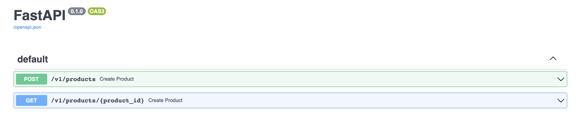

# FastAPI with DynamoDB

Simple application running on FastAPI and DynamoDB (using PynamoDB) 

## Requirements

* Python 3.9
* DynamoDB (pynamoDB)
* FastAPI
* Docker

## Run

```
docker compose up -d
```

## Tests

```
docker compose exec app pytest -s -v
```

You should get success:
```
collected 2 items

tests/test_main.py::test_product_create PASSED
tests/test_main.py::test_product_get PASSED

=== 2 passed in 0.26s ===
```

## OpenAPI Docs

* 0.0.0.0:8080/docs

